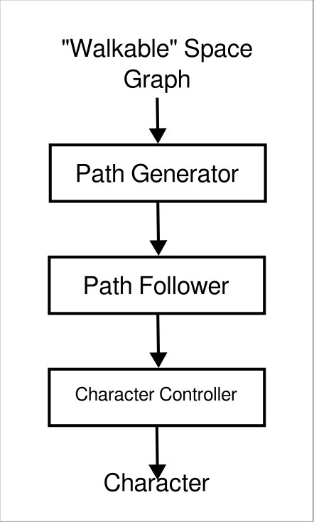

# Creature Control

This is an Outer Wilds Mod that implements a whole stack for generating and following paths for pathfinding and pathfollowing.

## The envisioned stack

The stack envisioned is the following:

- "Walkable" Space Graph: The graph that represents the "walkable" space.   "Walkable"  cause this graph can include regions that you would need to perform an action or something to cross it, be it , for example, an "Air" space (so you need to either be able to fly or jump), or a "Pipe" space (where you need to interact with a teleporter to get teleported somewhere else). This graph is also not limited to 2D! (**This can be cached**)
- Path Generator: This takes our graph, a target transform (position and rotation, or just position) and our current transform and tries to find a path on the graph that best connects both. If the target and the character are outside the graph, it will need to get the best vertex on the graph that can represent it. (**This only runs once per target change**)
- Path Follower: This figures out how to best follow the path generated from the generator. It can "see" dynamic obstacles, and avoid them somehow. It returns the pos, vel and rot for the character to reach the next part of the path. (**This runs _almost_ every frame,  at best only when the character reaches the part of the path it planned to reach**)
- Character Controller: This takes the pos, vel and rot the Path Follower wants and translates it to character commands, like if it was controlling with a controller (**This runs every frame**)
- Character: The actual character with its rigidbodies and physical limitations, the bottom part of the stack needs to be tailored to fit its capabilities.
